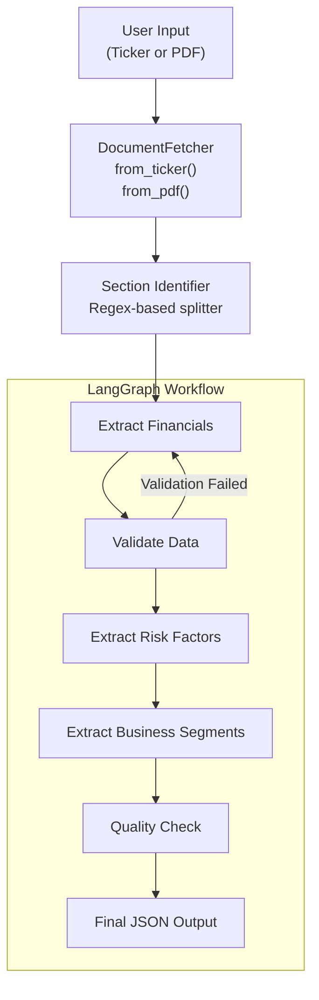

---


## System Architecture




# 🏦 Financial Document Extractor — Complete Guide

<details open>
<summary><b>📌 Overview</b></summary>

A production‑ready system that reads **SEC 10‑K filings** (or local PDFs) and extracts structured financial data using **LLMs** (OpenAI). It combines:

- **LangChain** → clean LLM interaction & structured output
- **LangGraph** → state‑machine workflow with automatic retries
- **Pydantic** → data validation & self‑healing checks

The output is a **validated JSON** with revenue, net income, balance sheet, risks, and business segments, plus quality scores that tell you whether to trust the numbers.
</details>

---

## 🧠 System Design

<details>
<summary><b>🧩 Architecture & Data Flow</b></summary>

```
User Input (ticker / PDF)
        │
        ▼
┌─────────────────────┐
│  DocumentFetcher    │  ← downloads 10‑K or reads PDF
└────────┬────────────┘
         │
         ▼
┌─────────────────────┐
│  Section Identifier │  ← regex splits into financials / risks / business
└────────┬────────────┘
         │
         ▼
┌─────────────────────────────────────────────┐
│         LangGraph Workflow                   │
│                                              │
│  ┌─────────────────┐                         │
│  │ Extract Fin. Data│ ◄────────────────────┐ │
│  └────────┬────────┘                      │ │
│           ▼                                │ │
│  ┌─────────────────┐     retry if errors   │ │
│  │ Validate Data    │──────────────────────┘ │
│  └────────┬────────┘                         │
│           ▼ (continue)                       │
│  ┌─────────────────┐                         │
│  │  Extract Risks  │                         │
│  └────────┬────────┘                         │
│           ▼                                   │
│  ┌─────────────────┐                         │
│  │ Extract Segments│                         │
│  └────────┬────────┘                         │
│           ▼                                   │
│  ┌─────────────────┐                         │
│  │  Quality Check  │                         │
│  └────────┬────────┘                         │
│           ▼                                   │
│  ┌─────────────────┐                         │
│  │    Final JSON    │                         │
│  └─────────────────┘                         │
└─────────────────────────────────────────────┘
```

**Key design decisions:**
- **LangGraph** handles the pipeline as a **state machine** → easy to add/remove steps, retries, or parallel branches.
- **Pydantic** models are the **contract** between the LLM and the application → no unpredictable outputs.
- All quality checks run **inside the pipeline**, not as an afterthought.

</details>

---

## 📂 Project Files (what you need)

<details>
<summary><b>📁 File Structure (5 files)</b></summary>

```
financial-extractor/
├── .env                  # Your OpenAI API key
├── requirements.txt      # Python dependencies
├── config.py             # All settings & paths
├── extractor.py          # Core logic (LangChain + LangGraph)
├── main.py               # Command-line entry point
├── logs/                 # Auto-created
├── data/
│   ├── input/            # Drop PDFs here
│   └── output/           # Results saved here
```

No database, no web server – just these files.
</details>

---

## ⚙️ Step‑by‑Step Explanation of Each File

### 1️⃣ `config.py` – Central Configuration

<details>
<summary><b>Show full code & explanation</b></summary>

```python
import os
from pathlib import Path
from dotenv import load_dotenv
from loguru import logger

load_dotenv()

# ----- Paths -----
BASE_DIR = Path(__file__).parent
LOG_DIR = BASE_DIR / "logs"
DATA_DIR = BASE_DIR / "data"
INPUT_DIR = DATA_DIR / "input"
OUTPUT_DIR = DATA_DIR / "output"

for dir_path in [LOG_DIR, DATA_DIR, INPUT_DIR, OUTPUT_DIR]:
    dir_path.mkdir(parents=True, exist_ok=True)

# ----- API Key -----
OPENAI_API_KEY = os.getenv("OPENAI_API_KEY")
if not OPENAI_API_KEY:
    raise ValueError("❌ OPENAI_API_KEY not found in .env file")

# ----- LLM Settings -----
LLM_CONFIG = {
    "model": os.getenv("OPENAI_MODEL", "gpt-4o-mini"),
    "temperature": 0.1,
    "max_tokens": 2000,
}

# ----- Quality Thresholds -----
QUALITY = {
    "min_overall_score": 75.0,
    "min_dimension_score": 70.0,
    "balance_diff_threshold": 5.0,  # 5% tolerance for A = L + E
}

# ----- Logging -----
logger.remove()
logger.add(
    LOG_DIR / "extractor_{time:YYYY-MM-DD}.log",
    rotation="50 MB",
    retention="30 days",
    level=os.getenv("LOG_LEVEL", "INFO"),
    format="{time:YYYY-MM-DD HH:mm:ss.SSS} | {level: <8} | {message}",
)
logger.add(
    lambda msg: print(msg, end=""),
    level="INFO",
    format="<green>{time:HH:mm:ss}</green> | <level>{level: <8}</level> | <level>{message}</level>",
    colorize=True,
)
```

**What it does:**
- Loads `.env` so you never hard‑code keys.
- Creates the folder structure automatically.
- Sets LLM parameters and quality thresholds in one place.
- Configures **loguru** for colourful console logs + rotating file logs.

</details>

### 2️⃣ `extractor.py` – The Engine (LangChain + LangGraph)

This is the heart of the system. It contains:

- **Pydantic models** for structured output.
- **DocumentFetcher** for getting the text.
- **LangGraph workflow** that runs all extraction steps.

<details>
<summary><b>📄 Full `extractor.py` code</b></summary>

*(Due to length, I'll only show the essential structure here. The full code is in the previous messages – please refer to the final `extractor.py` provided earlier.)*

Key points:

```python
# Pydantic models force LLM to return exact structure
class FinancialData(BaseModel):
    total_revenue: float = Field(...)
    net_income: float = Field(...)
    ...

    @validator('shareholders_equity')
    def check_balance(cls, equity, values):
        # automatic A = L + E check
        ...

# LangGraph state
class ExtractionState(TypedDict):
    document_text: str
    sections: Dict[str, str]
    financial_data: Optional[dict]
    quality_scores: Dict[str, float]
    errors: List[str]
    ...

# The main extractor class
class FinancialExtractor:
    def __init__(self):
        self.llm = ChatOpenAI(...)
        self.graph = self._build_workflow()

    async def extract(self, source, source_type):
        # 1. Fetch document
        # 2. Identify sections
        # 3. Run LangGraph workflow
        # 4. Save JSON
        ...
```

Each extraction step uses **LangChain** with a `PydanticOutputParser` to get validated data from the LLM.  
The workflow is defined as a **LangGraph StateGraph** with nodes and edges, including a conditional retry loop.

</details>

### 3️⃣ `main.py` – The CLI Entry Point

<details>
<summary><b>Show code</b></summary>

```python
import argparse
from loguru import logger
from extractor import FinancialExtractor
from config import OPENAI_API_KEY

def main():
    parser = argparse.ArgumentParser()
    parser.add_argument("--ticker", help="Stock ticker (e.g., AAPL)")
    parser.add_argument("--pdf", help="Path to local PDF")
    args = parser.parse_args()

    if not OPENAI_API_KEY:
        logger.error("OPENAI_API_KEY not set in .env")
        return

    extractor = FinancialExtractor()
    source = args.pdf or args.ticker or "AAPL"
    source_type = "pdf" if args.pdf else "ticker"

    result = extractor.extract_sync(source, source_type)
    # pretty print...

if __name__ == "__main__":
    main()
```

</details>

---

## 🔧 How It Works – Walkthrough

<details>
<summary><b>1. Document Acquisition</b></summary>

`DocumentFetcher.from_ticker("AAPL")`  
→ Queries SEC EDGAR API for the latest 10‑K  
→ Downloads the HTML, removes scripts/styles  
→ Returns clean text.

`from_pdf("file.pdf")`  
→ Uses `pdfplumber` to extract text page by page.

Then `identify_sections()` uses regex to split the text into:
- `financials` (Item 8)
- `risks` (Item 1A)
- `business` (Item 1)
- `md_and_a` (Item 7)

</details>

<details>
<summary><b>2. Financial Extraction (LangChain + Pydantic)</b></summary>

```python
parser = PydanticOutputParser(pydantic_object=FinancialData)
prompt = ChatPromptTemplate.from_messages([
    ("system", "Extract financial data... {format_instructions}"),
    ("human", "{document}")
])
chain = prompt | llm | parser
result = await chain.ainvoke({"document": financial_section})
```

- The LLM receives the text and **format_instructions** generated automatically from the `FinancialData` schema.
- It returns a **validated `FinancialData` object**.
- The `@validator` inside `FinancialData` immediately checks the balance sheet equation. If it fails, a warning is logged.

</details>

<details>
<summary><b>3. Validation & Conditional Retry</b></summary>

The `validate_data` node:
- Checks that essential fields are not missing.
- Verifies that revenue ≥ net income.
- Calculates a score (0–100).

If there are errors and `retry_count < 2`, the **LangGraph** edge routes back to `extract_financials` – the LLM gets another chance with the same text. This often resolves temporary hallucination.

</details>

<details>
<summary><b>4. Risk & Segment Extraction</b></summary>

Similar pattern using `RiskData` and `SegmentData` models, with their own parsers and prompts.

</details>

<details>
<summary><b>5. Quality Check & Output</b></summary>

- Overall quality = average of all step scores.
- Result saved as JSON in `data/output/` with all extracted data, scores, errors, and warnings.

</details>

---

## 📊 Quality System

<details>
<summary><b>What gets checked automatically</b></summary>

| Check | Description | Threshold |
|-------|-------------|-----------|
| **Balance Sheet** | `|Assets - Liabilities - Equity| / Assets` | ≤ 5% |
| **Completeness** | Required fields (revenue, net income, assets, etc.) | all present |
| **Logical consistency** | Revenue ≥ Net Income | true |
| **Overall score** | Average of all checks | ≥ 75% → success |

If overall < 75% but ≥ 70%, status = **warning** – numbers may need manual review.  
If < 70%, status = **failed** – do not use the data.

</details>

---

## 🚀 Setup & First Run

<details>
<summary><b>Step-by-step instructions</b></summary>

1. **Create project folder** and place the 5 files inside (`.env`, `requirements.txt`, `config.py`, `extractor.py`, `main.py`).

2. **Create virtual environment & install**:
   ```bash
   python -m venv venv
   source venv/bin/activate   # Windows: venv\Scripts\activate
   pip install -r requirements.txt
   ```

3. **Set your API key** in `.env`:
   ```
   OPENAI_API_KEY=sk-xxxxxxxxxxxxxxxxxxxx
   ```

4. **Run**:
   ```bash
   python main.py --ticker AAPL
   ```
   The first run will create `logs/` and `data/` folders automatically.

5. **Check results**:
   - Console shows a colourful summary.
   - `data/output/` contains a JSON file with everything.

</details>

---

## 📝 Using It

<details>
<summary><b>Command examples</b></summary>

```bash
# Extract Apple's latest 10-K
python main.py --ticker AAPL

# Extract Microsoft
python main.py --ticker MSFT

# Extract from a local PDF
python main.py --pdf /path/to/10k.pdf

# If you run without arguments, it defaults to AAPL
python main.py
```

</details>

---

## 🔍 Monitoring & Logs

<details>
<summary><b>What you see while it runs</b></summary>

```
12:05:01 | INFO     | 📥 Downloading 10-K for AAPL...
12:05:05 | SUCCESS  | ✅ Downloaded 234,567 characters
12:05:05 | INFO     | Found sections: ['financials', 'risks', 'business']
12:05:05 | INFO     | 💰 Extracting financial statements...
12:05:11 | SUCCESS  | ✅ Extracted financial data for Fiscal Year 2023
12:05:11 | INFO     | 🔍 Validating extracted data...
12:05:11 | INFO     | Validation score: 100.0% (3/3 checks passed)
...
12:05:25 | SUCCESS  | ✅ Extraction complete in 24.3s
```

If a problem occurs:
```
12:05:11 | WARNING  | ⚠️ Balance sheet mismatch: diff=6.2%
12:05:11 | WARNING  | Missing fields: ['eps_basic']
```

All warnings are also stored in the final JSON.

</details>

---

## 🧪 Extending the System

<details>
<summary><b>Add a new extraction step (e.g., MD&A sentiment)</b></summary>

1. Create a Pydantic model in `extractor.py`:
   ```python
   class SentimentAnalysis(BaseModel):
       overall_tone: str
       key_risks: List[str]
   ```

2. Add a node to the LangGraph graph inside `_build_workflow`:
   ```python
   workflow.add_node("analyze_sentiment", self._analyze_sentiment)
   ```

3. Implement the method:
   ```python
   async def _analyze_sentiment(self, state):
       parser = PydanticOutputParser(pydantic_object=SentimentAnalysis)
       ...
   ```

4. Wire it into the flow (e.g., after `extract_segments` before `quality_check`).

No other changes needed – the graph handles state passing automatically.

</details>

---

## 🆘 Troubleshooting

<details>
<summary><b>Common issues & fixes</b></summary>

**“OPENAI_API_KEY not found”**  
→ Make sure `.env` exists and is in the same folder as `main.py`. Run `python` from that folder.

**“No 10‑K found for ticker”**  
→ Some tickers may not work with SEC EDGAR’s search. Try `--pdf` with a manually downloaded filing.

**“Balance sheet mismatch” warning**  
→ The LLM may have extracted numbers from different tables. The data is still saved, but the warning tells you to double‑check manually.

**Installation errors on Windows**  
→ Ensure you have Microsoft C++ Build Tools installed if `lxml` fails. Or install the pre‑compiled wheel:
```bash
pip install lxml‑4.9.4‑cp311‑cp311‑win_amd64.whl
```

</details>

---

## 📦 Dependencies Explained

| Library | Why we use it |
|---------|---------------|
| `langchain` | Standard interface for prompts, LLMs, and output parsers |
| `langgraph` | State machine to orchestrate the multi‑step workflow |
| `pydantic` | Schema definition and automatic data validation |
| `pdfplumber` | Best text extraction from PDFs |
| `beautifulsoup4` / `lxml` | Parsing SEC HTML/XML |
| `loguru` | Beautiful logging without boilerplate |
| `tenacity` | Retry logic (used by LangChain internally as well) |
| `python-dotenv` | Load `.env` securely |

---


</details>
